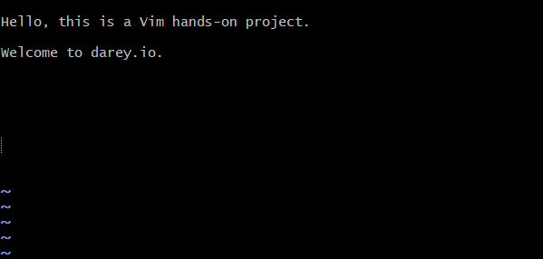
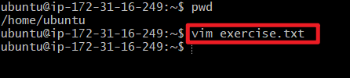
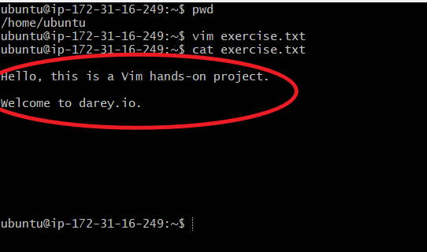
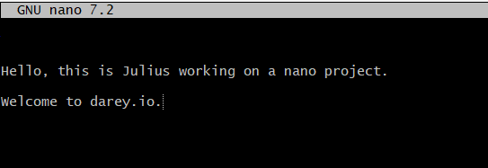
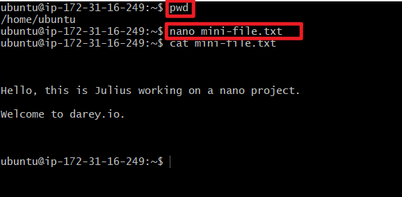

# Linux Text Editor
---
A Linux text editor is a software application specifically designed for creating, and managing text files on a Linux-based operating system. Text editors play a crucial role in the Linux environment, providing a means for users to interact with and manipulate plain text files, configuring files, scripts, and other text-based documents.

There are various text editors available in the Linux ecosystem, each with its own set of features and user interface.

**1. Vim Text Editor**

The Linux Vim text editor is a powerful and versatile text editing tool deeply ingrained in the Unix and Linux ecosystem. Vim is build upon the foundation of the original Vi editor, offering an extensive set of features, modes, and commands that empower users to manipulate text efficiently. 

Below is an example of Vim interface containing a text file.

**Working with Vim Editor**

* Open a new file named **"exercise.txt"** using the following command.

    **`vim exercise.txt`**

This command creates the **"exercise.txt"** and open the file up so that we can start writing into it. Its just like opening up a Notepad file on Windows operating system.

* Enter Insert Mode to edit the file.

    * Press "i" to enter insert mode.
  
    * Type the following text into to the file:

        Hello, this is a Vim hands-on project.

        Welcome to darey.io.

* **Deleting a Character:** Press "esc" on your keyboard to exit the "insert mode". Position the cursor on a character you want to delete and press "x".

* **Deleting a Line:** To delete an entire line in the file, ensure that you are not in the **"insert mode"**. If you are in the insert mode, simply press the **"esc"** key. Then, place the cursor on the line, and press **"d"** twice on your keyboard to delete the entire line.

* **Undoing Changes:** Make a change (add or delete text) in "Insert or Normal Mode", then press **"Esc"** to enter Normal Mode and press "u" to undo the last change.

*  **Saving Changes:** After you have finished writing into the file, press **"Esc"**, then type **wq** and press Enter. This will save the file. **w** means **write** and **q** means **quit** which basically quits the vim mode and returns back to the terminal.

*  **Quitting Without Saving:** Incase you do not intend to save the file, simply press **"Esc"**, then type **q!** and press **Enter** to quit without saving changes.

**2. Nano Text Editor**

Among Linux text editors, nano stands out as a user-friendly and straightforward tool, making it an excellent choice for users who are new to the command line or those who prefer a more intuitive editing experience. Nano serves as a versatile and lightweight text editor, ideal for performing quick edits, writing scripts, or making configuration changes directly from the command line.

Below is an example of Nano interface containing a text file.

**Working With Nano Editor**

* Opening a file named **"mini-file.txt"** using the following command:

    **`nano mini_file.txt`**

* **Entering and Editing Text:** Type a few lines of text into the file as shown above. Nano has a simple interface, and you can start typing immediately.

* **Saving Changes:** Save your changes by pressing **"ctrl + o"**. Nano will prompt you to confirm the filename; press **"Enter"** to confirm.

* **Exiting Nano:** If you wish to exit nano without saving the file, simply press **"ctrl + x"**. If you have unsaved changes, nano will prompt you to save before exiting.

